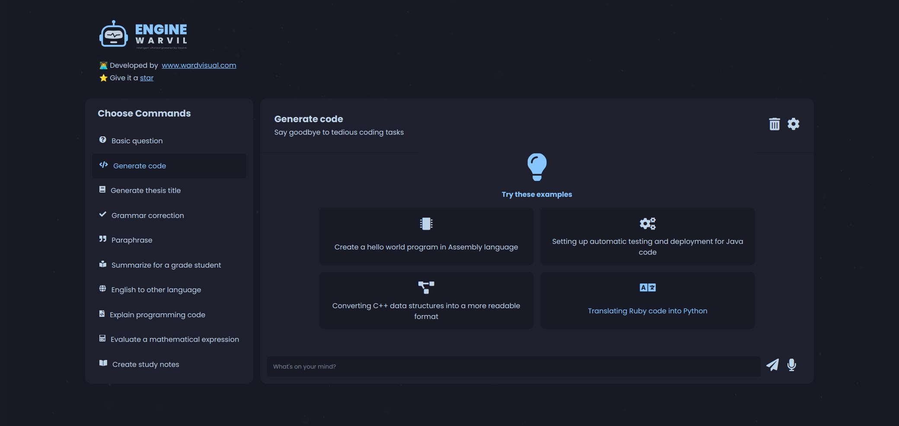

<div id="top"></div>

<!-- PROJECT LOGO -->
<br />
<div align="center">
  <a href="https://github.com/wardvisual/engine-ChatGuru">
    
  </a>
  <br />
  <h2 align="center">ChatGuru</h2>

  <p align=" center">ChatGuru is an intelligent chatbot powered by OpenAI. It is designed to provide helpful and insightful answers to your questions. ChatGuru can learn from its conversations with you, allowing it to become increasingly efficient and knowledgeable over time.</p>
    <br />
    <a href="https://engine-ChatGuru.vercel.app/"><strong>View Project »</strong></a>
    <br />    
    <br />
    <a href="https://github.com/wardvisual/engine-ChatGuru">View Demo</a>
    ·
    <a href="https://github.com/wardvisual/engine-ChatGuru/issues">Report Bug</a>
    ·
    <a href="https://github.com/wardvisual/engine-ChatGuru/issues">Request Feature</a>
  
</div>

<br />
<a href="https://github.com/wardvisual/engine-ChatGuru">
   
</a>

<br />
<!-- BUILT WITH -->

<hr />

### Built With

- [Next.js](https://nextjs.org/)
- [Typescript](https://www.typescriptlang.org/)
- [OpenAI](https://openai.com/)

### Prerequisites

- Docker installed on your machine
- Node.js and npm installed on your machine
- A code editor of your choice
- Familiarity with terminal or command prompt

<!-- INSTALLATION -->

### Installation

1. Clone the repo

   ```sh
   git clone https://github.com/wardvisual/engine-ChatGuru.git
   ```

### Setup

1. Navigate to the Directory

   ```sh
   cd engine-ChatGuru
   ```

2. Create a copy of `.env.example` file

   ```sh
   cp .env.example .env
   ```

3. Enter your OpenAI API Key in `.env` file

   ```sh
   OPENAI_API_KEY = 'ENTER YOUR OpenAI API KEY'
   ```

4. Make the `docker-entrypoint.sh` script executable

   ```sh
   chmod +x docker-entrypoint.sh
   ```

5. Build the Docker Image

   ```sh
   docker compose up --build --force-recreate
   ```

6. Access the Application

   You can now access the ChatGuru application by visiting `http://localhost:3000` in your web browser.

<hr />

<!-- FEATURES -->

### Key Features

Some of these features may not respond correctly while they are being developed.

<details>
  <summary>Answer Basic Questions </summary>
    ChatGuru is able to answer basic questions about a variety of topics using artificial intelligence.
</details>
<details>
  <summary>Generate Code </summary>
    ChatGuru can generate code for a variety of programming languages based on your specifications.
</details>
<details>
  <summary>Generate Thesis Titles </summary>
    ChatGuru can generate potential titles for your thesis or research project.
</details>
<details>
  <summary>Correct Grammar </summary>
    ChatGuru can help you improve your writing by correcting grammar errors and providing suggestions for improvement.
</details>
<details>
  <summary>Paraphrase Text </summary>
    ChatGuru can rewrite text to convey the same information in a different way, making it easier to understand.
</details>
<details>
  <summary>Summarize </summary>
    ChatGuru can generate a summary of longer pieces of text, helping you save time and focus on the most important information.
</details>
<details>
  <summary>Translate to Other Languages </summary>
    ChatGuru can translate text from English to a variety of other languages.
</details>
<details>
  <summary>Explain Programming Code </summary>
    ChatGuru can provide explanations and examples for programming concepts and code snippets.
</details>
<details>
  <summary>Evaluate Mathematical Expressions </summary>
    ChatGuru can evaluate and simplify mathematical expressions.
</details>
 
<details>
  <summary>Create Study Notes </summary>
    ChatGuru can generate study notes based on text input, helping you learn and retain information more effectively.
</details>

<hr />

<!-- LICENSE -->

## License

Distributed under the MIT License. See `LICENSE` for more information.

<!-- CONTACT -->

## Contact

Klei Aliaj: [Wardvisual](https://wardvisual.me/)

Project Link: [ChatGuru](https://engine-ChatGuru.vercel.app/)
